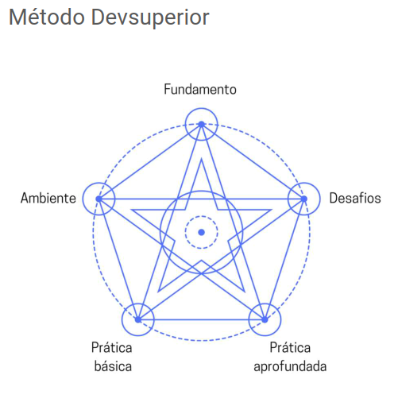
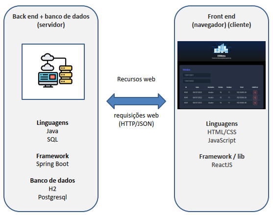
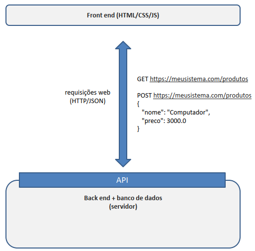
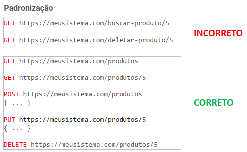
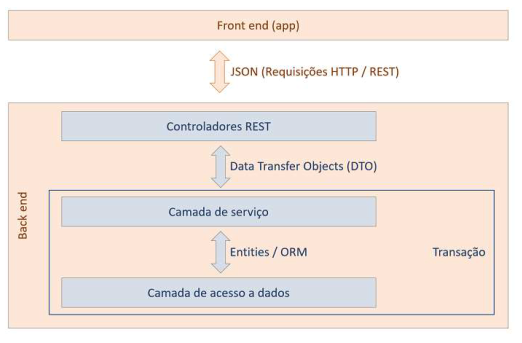
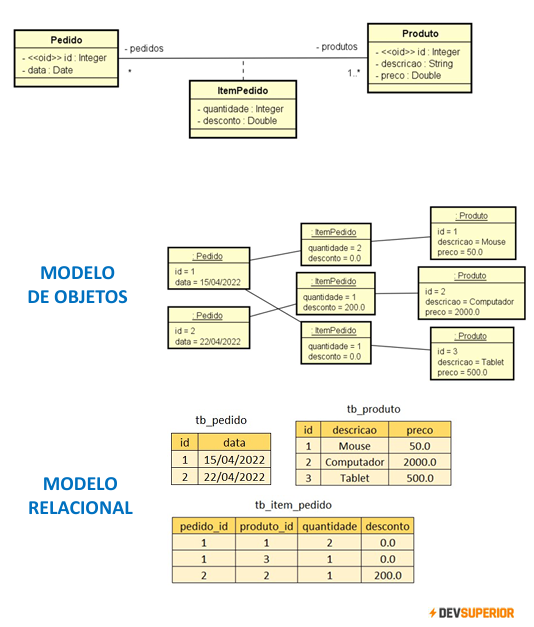

# Intensivão Java Spring - Edição maio/25

https://www.youtube.com/devsuperior

Canal oficial da Devsuperior exclusivo para transmitir treinamentos sobre carreira back end Java e Spring. Professor Dr. Nelio Alves. www.youtube.com/@DevsuperiorJavaSpring

## <a name="indice">Índice</a>

1. [Episódio 1: Projeto estruturado](#parte1)
2. [Episódio 2: Domínio, consultas](#parte2)
3. [Episódio 3: Homologação, CORS](#parte3)
4. [Episódio 4: Endpoint especial](#parte4)
5. [Episódio 5: Resumão e conclusão do aprendizado](#parte5)
---

## <a name="parte1">1 - Episódio 1: Projeto estruturado</a>

### API Rest

### Padrão Rest

- Cliente/servidor com HTTP
- Comunicação stateless (*)
- Interface uniforme, formato padronizado (*)
- Cache
- Sistema em camadas
- Código sob demanda (opcional)

https://www.redhat.com/pt-br/topics/api/what-is-a-rest-api

### Padrão camadas

- Baixar projeto referência pronto:
  https://github.com/devsuperior/dslist-backend
- Criar projeto / lib Maven
- Salvar no Github
- Arquivos Properties, entidade Game, ORM - Seed dos games
- GameMinDTO, GameRepository, GameService, GameController

[Voltar ao Índice](#indice)

---

## <a name="parte2">2 - Episódio 2: Domínio, consultas</a>

### Relacionamentos

- Baixar projeto referência pronto:
  https://github.com/devsuperior/dslist-backend
- Implementar modelo de domínio
- Atualizar seed da base de dados
- GameDTO, busca game por id
- Busca totas listas em /lists
- Consulta SQL, projection, busca de games por lista

[Voltar ao Índice](#indice)

---

## <a name="parte3">3 - Episódio 3: Homologação, CORS</a>

[Voltar ao Índice](#indice)

---

## <a name="parte4">4 - Episódio 4: Endpoint especial</a>

[Voltar ao Índice](#indice)

---

## <a name="parte5">5 - Episódio 5: Resumão e conclusão do aprendizado</a>

[Voltar ao Índice](#indice)

---